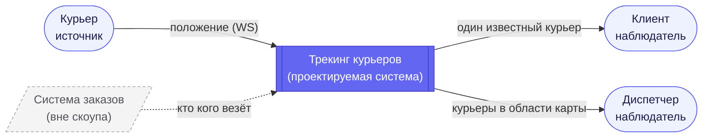
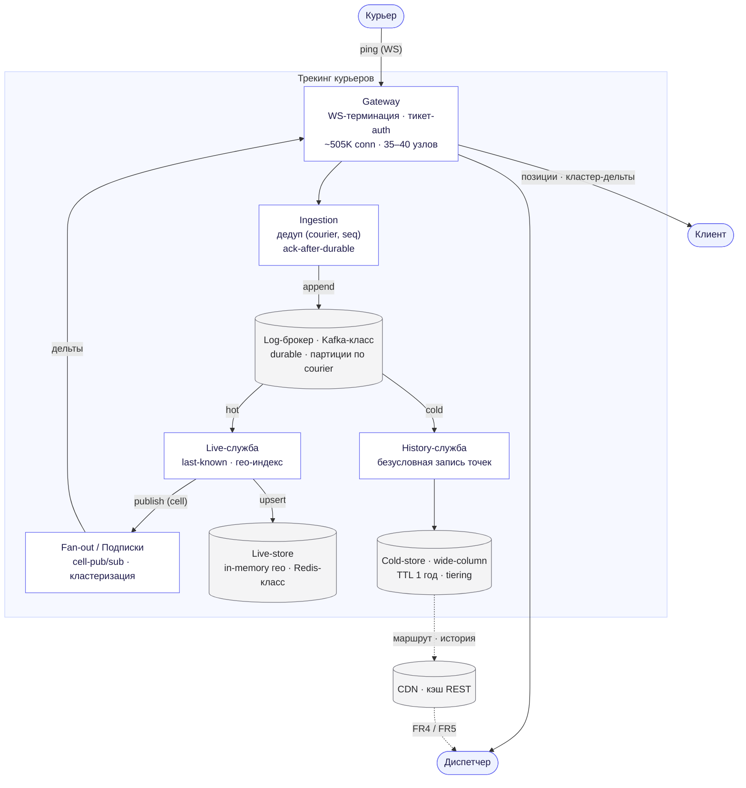
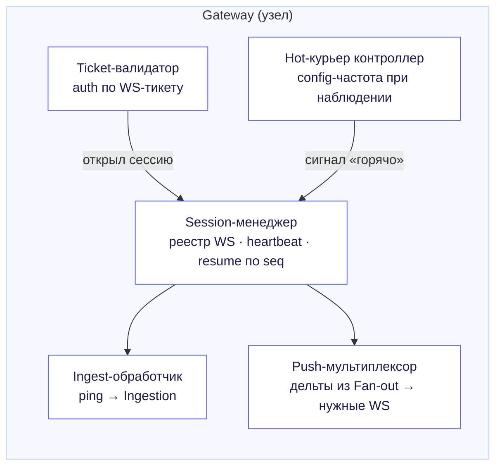
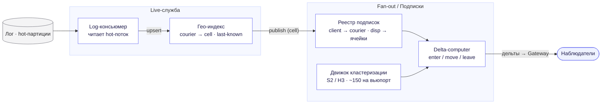

# 1. Схемы C4

Нотация [C4](https://c4model.com/): три уровня приближения — система целиком (Context),
её контейнеры (Containers) и внутреннее устройство ключевых контейнеров (Components).
Диаграммы — в нотации [Mermaid](https://mermaid.js.org/), рендерятся на клиенте; границы
системы показаны как подграфы, типы узлов (актор / контейнер / хранилище) — цветом.

Сквозной принцип, который протягивается через все уровни, заложен ещё в API (артефакт 03, §5):
**горячий путь** (свежесть, NFR1) и **холодный путь** (durability, NFR2) физически разведены.
Их видно уже на уровне контейнеров как две независимые ветви от одного лог-брокера.

---

# 2. Уровень 1 — Контекст

Система — чёрный ящик, который **только поставляет данные о местоположении**. Назначение
заказов, маршрутизация и ETA — внешние системы вне скоупа; они влияют лишь на то, *кто за кем
наблюдает*, но в потоки данных не входят.

| Актор / система | Направление | Взаимодействие |
|---|---|---|
| Курьер | → система | Шлёт своё положение в фоне (WS-ingest, FR1) |
| Клиент | ← система | Следит за **одним** известным курьером (FR2) |
| Диспетчер | ← система | Следит за **областью карты** — произвольный набор курьеров (FR3–FR5) |
| Система заказов | вне скоупа | Определяет связку «клиент ↔ курьер»; в трекинг не входит |

Ключевая развязка уровня контекста — два паттерна доступа у потребителей: **подписка на сущность**
(клиент → курьер) и **подписка на область** (диспетчер → bbox). Дальше они расходятся в разные
контейнеры.

---

# 3. Уровень 2 — Контейнеры

Восемь логических контейнеров. От одного durable-лога расходятся две ветви: горячая (in-memory,
для живой раздачи) и холодная (безусловная запись истории).

| Контейнер | Роль | Технология (класс) | Состояние |
|---|---|---|---|
| Gateway | Терминация всех WS, аутентификация по тикету, push наблюдателям | WS-сервер (Go/Netty) + L4-LB | Stateful: держит соединения |
| Ingestion | Приём пингов, дедуп `(courierId, seq)`, durable-append, `ack` | Stateless-консьюмер | Stateless |
| Log-брокер | Durable append-only лог, источник правды, реплей, развязка | Kafka / Pulsar / Redpanda | Stateful: партиции |
| Live-служба | Поддерживает last-known позицию, гео-индекс, публикует в pub/sub | Stateless над стором | Stateless |
| Live-store | Последняя точка каждого курьера, индекс по гео-ячейкам | Redis-класс (in-memory) | Stateful: горячие данные |
| Fan-out / Подписки | Реестр подписок, cell-pub/sub, серверная кластеризация вьюпортов | Stateless-роутер | Полу-stateful: подписки |
| History-служба | Безусловная запись каждой точки, чтение маршрута/истории | Stateless | Stateless |
| Cold-store | История за 1 год, партиции `(courierId, day)`, TTL + tiering | Cassandra/Scylla, ClickHouse для аналитики | Stateful: durable |
| CDN | Кэш REST-снапшотов и истории, ближе к региону наблюдателя (NFR4) | CDN-edge | Кэш |

**Четыре потока данных.**

1. **Ingest (FR1).** Курьер → Gateway → Ingestion → durable-append в лог → `ack` курьеру.
   `ack` только после durable-записи (NFR2); до него устройство буферит и переотправляет.
2. **Горячий (FR2, FR3).** Лог → Live-служба обновляет last-known + публикует в pub/sub по
   гео-ячейке → Fan-out/Подписки разворачивает на наблюдателей → Gateway → клиент/диспетчер.
3. **Холодный (FR4, FR5).** Тот же лог → History-служба пишет **каждую** точку в cold-store,
   независимо от того, наблюдают курьера или нет.
4. **Чтение по требованию.** Снапшот вьюпорта, маршрут за сегодня, история — REST через CDN,
   мимо горячего пути.

Почему два консьюмера от одного лога, а не запись «вилкой» в приложении: лог даёт **реплей**.
Если live-store или cold-store упал/отстал — переигрываем с нужного оффсета, не теряя точек.
Это и есть материализация развязки «свежесть ↔ durability» из артефакта 03.

---

# 4. Уровень 3 — Компоненты

Раскрываем два контейнера, где сосредоточена основная сложность системы (артефакт 02): **Gateway**
(полмиллиона соединений) и **Live + Fan-out** (контроль fan-out при плотных вьюпортах).

## 4.1 Gateway

Gateway — единственный stateful-тир на пути соединений. Он держит WS, но **не хранит** данные
домена: позиции живут в live-store, история — в cold-store. Resume по `seq` позволяет узлу
отдавать соединение при rolling-деплое без потери пингов.

## 4.2 Live-служба и Fan-out

Ядро контроля fan-out — **гео-ячейка как единица подписки**. Курьер публикует в ячейку, в которой
находится; наблюдатель подписан на ячейку (клиент — на ячейку своего курьера, диспетчер — на набор
ячеек вьюпорта). Раздача идёт только в пересечение «кто публикует × кто подписан», а не широковещанием.
Движок кластеризации сворачивает плотные ячейки в маркеры (~150 на вьюпорт), и только индивидуально
отрисованные курьеры остаются «горячими». Так fan-out из артефакта 02 удерживается от гигабит/с
(детально — артефакт 06).

---

# 5. Соответствие предыдущим артефактам

Проверка, что контейнеры не вводят сущностей сверх того, что уже обосновано.

| Контейнер | Откуда следует |
|---|---|
| Gateway, ~35–40 узлов | Расчёт соединений ≈505K (артефакт 02, §5) |
| Log-брокер | Durable-ack и реплей (артефакт 03, §2; NFR2) |
| Live-store, гео-индекс | Горячий путь, server-push (артефакт 03, §1.2) |
| Fan-out + кластеризация | Подписка на область, ~150 маркеров (артефакт 03, §3) |
| Cold-store, TTL + tiering | 82 ТБ/год, удаление за пределами года (артефакт 02, §3) |
| CDN | Кэш REST, наблюдатель в регионе курьера (NFR4) |

Архитектура полностью покрывается требованиями и расчётами; новых допущений уровень контейнеров
не вносит. Дальше — паттерны, которые стоят за этими решениями (артефакт 05).
